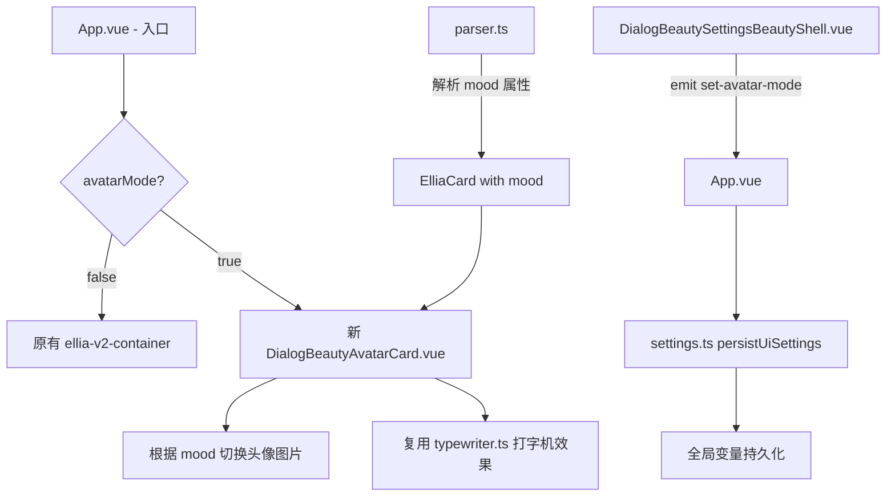
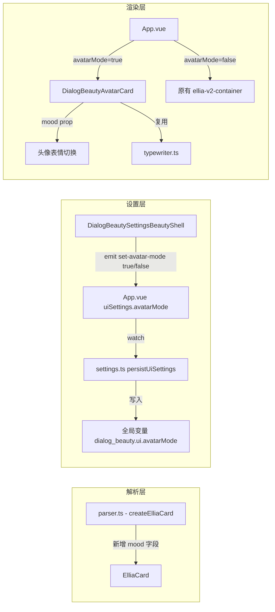
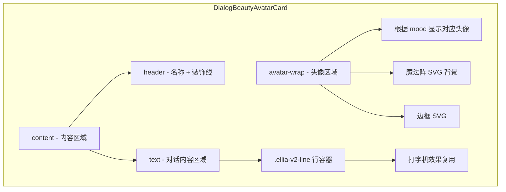

# 对话美化 - 带头像模式实施方案

## 需求概述

当 `DialogBeautySettingsBeautyShell`
中"您难道好奇我的面容？"选项设为**是**时，对话美化切换到带头像的新样式。该设置需持久化到全局变量，新样式需要解析
`<ellia>` 标签的 `mood` 属性以切换头像表情，同时保留打字机动画效果。

### 对话示例

```html
<ellia name="艾莉亚" mood="期待">「如果您想听我说什么…」</ellia>
```

## 架构分析



## 数据流



## 变更文件清单

### 1. [`types.ts`](src/dialog_beauty/types.ts) - 扩展类型定义

**变更内容：**

- `ElliaCard` 接口新增 `mood?: string` 可选字段
- `DialogBeautyUiSettings` 接口新增 `avatarMode: boolean` 字段

```typescript
// ElliaCard 新增
export interface ElliaCard {
  // ...existing fields
  mood?: string; // 从 <ellia mood="期待"> 解析得到
}

// DialogBeautyUiSettings 新增
export interface DialogBeautyUiSettings {
  fontMode: FontMode;
  animationEnabled: boolean;
  typewriterSpeed: TypewriterSpeed;
  avatarMode: boolean; // 新增：是否使用带头像的对话美化
}
```

### 2. [`parser.ts`](src/dialog_beauty/parser.ts) - 解析 mood 属性

**变更内容：**

- `createElliaCard()` 函数中新增解析 `mood` 属性的逻辑

```typescript
export function createElliaCard(attrText: string, rawBody: string, index: number): ElliaCard | null {
  // ...existing code
  const nameMatch = attrText.match(/\bname=(['"])(.*?)\1/);
  const moodMatch = attrText.match(/\bmood=(['"])(.*?)\1/); // 新增

  return {
    // ...existing fields
    name: nameMatch?.[2]?.trim() || '艾莉亚',
    mood: moodMatch?.[2]?.trim() || undefined, // 新增
    // ...
  };
}
```

### 3. [`constants.ts`](src/dialog_beauty/constants.ts) - 新增 mood 映射常量

**变更内容：**

- 新增 `MOOD_AVATAR_MAP` 常量，定义 mood 值到头像图片 URL 和 CSS class 的映射
- 映射数据来源于 `singlehtml/对话美化带头像.html`

```typescript
export interface MoodAvatarEntry {
  cssClass: string;
  primaryUrl: string;
  fallbackUrl: string;
}

// 默认 mood 为 smile
export const DEFAULT_MOOD = 'smile';

export const MOOD_AVATAR_MAP: Record<string, MoodAvatarEntry> = {
  smile: {
    cssClass: 'e-smile',
    primaryUrl: 'https://files.catbox.moe/elgw3w.png',
    fallbackUrl: 'https://s3.bmp.ovh/2026/05/10/x7qQmRC2.png',
  },
  惊讶: {
    cssClass: 'e-surprise',
    primaryUrl: 'https://files.catbox.moe/5389fr.png',
    fallbackUrl: 'https://s3.bmp.ovh/2026/05/10/at3AloWb.png',
  },
  担心: {
    cssClass: 'e-worry',
    primaryUrl: 'https://files.catbox.moe/hom1zr.png',
    fallbackUrl: 'https://s3.bmp.ovh/2026/05/10/fsXibuf8.png',
  },
  温柔: {
    cssClass: 'e-gentle',
    primaryUrl: 'https://files.catbox.moe/g5fwcu.png',
    fallbackUrl: 'https://s3.bmp.ovh/2026/05/10/IeRlQkjj.png',
  },
  期待: {
    cssClass: 'e-expect',
    primaryUrl: 'https://files.catbox.moe/9xjb0c.png',
    fallbackUrl: 'https://s3.bmp.ovh/2026/05/10/lp95isi7.png',
  },
  敌视: {
    cssClass: 'e-hostile',
    primaryUrl: 'https://files.catbox.moe/88v1i9.png',
    fallbackUrl: 'https://s3.bmp.ovh/2026/05/10/CqN9I2pC.png',
  },
  施愿: {
    cssClass: 'e-grant',
    primaryUrl: 'https://files.catbox.moe/r94uy4.png',
    fallbackUrl: 'https://s3.bmp.ovh/2026/05/10/vkh0HmKm.png',
  },
  认真: {
    cssClass: 'e-serious',
    primaryUrl: 'https://files.catbox.moe/1av0zv.png',
    fallbackUrl: 'https://s3.bmp.ovh/2026/05/10/WGqI7ucl.png',
  },
  失措: {
    cssClass: 'e-panic',
    primaryUrl: 'https://files.catbox.moe/4qqins.png',
    fallbackUrl: 'https://s3.bmp.ovh/2026/05/10/2ze1Fgrt.png',
  },
  愉快: {
    cssClass: 'e-happy',
    primaryUrl: 'https://files.catbox.moe/wwch4a.png',
    fallbackUrl: 'https://s3.bmp.ovh/2026/05/10/oQL8FHeC.png',
  },
};
```

### 4. [`settings.ts`](src/dialog_beauty/settings.ts) - 处理 avatarMode 持久化

**变更内容：**

- `getDefaultUiSettings()` 返回值新增 `avatarMode: false`
- `normalizeUiSettings()` 处理 `avatarMode` 字段的读取和校验

### 5. [`DialogBeautySettingsBeautyShell.vue`](src/dialog_beauty/components/DialogBeautySettingsBeautyShell.vue) - 改为 emit 控制

**变更内容：**

- 移除本地 `isCuriousAboutFace` ref
- 从 props 中的 `uiSettings.avatarMode` 读取当前状态
- 点击"是/不是"按钮时 emit `set-avatar-mode` 事件

```vue
<!-- 变更前 -->
<button @click="isCuriousAboutFace = true">是</button>
<button @click="isCuriousAboutFace = false">不是</button>

<!-- 变更后 -->
<button @click="emit('set-avatar-mode', true)">是</button>
<button @click="emit('set-avatar-mode', false)">不是</button>
```

### 6. 新建 [`DialogBeautyAvatarCard.vue`](src/dialog_beauty/components/DialogBeautyAvatarCard.vue) - 带头像卡片组件

**设计要点：**

- 参考 `singlehtml/对话美化带头像.html` 的布局和样式
- 接收 `card: ElliaCard` 作为 prop，从中获取 `mood`、`name`、`lines` 等数据
- 使用 computed 根据 `card.mood` 从 `MOOD_AVATAR_MAP` 中获取对应的头像 URL
- 图片加载失败时自动切换到 fallback URL
- 保留 `.ellia-v2-line`、`.ellia-v2-action`、`.ellia-v2-char` 等 CSS class 名称，确保 `typewriter.ts` 的
  `renderStaticText()` 和 `buildTypewriterTimeline()` 能正常查找 DOM 元素并工作
- 保留 header 控制按钮（Play/Replay/Settings）的功能

**组件结构：**



### 7. [`App.vue`](src/dialog_beauty/App.vue) - 条件渲染

**变更内容：**

- 导入 `DialogBeautyAvatarCard` 组件
- 在 template 中根据 `uiSettings.avatarMode` 条件渲染：
  - `true` → 渲染 `DialogBeautyAvatarCard`
  - `false` → 渲染原有的 `ellia-v2-container`
- 新增 `setAvatarMode(enabled: boolean)` 方法
- 在 `DialogBeautySettingsPanel` 上传递新的事件处理

### 8. [`DialogBeautySettingsPanel.vue`](src/dialog_beauty/components/DialogBeautySettingsPanel.vue) - 透传事件

**变更内容：**

- 在 emit 定义中新增 `set-avatar-mode` 事件
- 在 `DialogBeautySettingsBeautyShell` 使用处透传 `@set-avatar-mode` 事件

## 关键设计决策

### 打字机效果复用

`typewriter.ts` 中的 `renderStaticText()` 和 `buildTypewriterTimeline()` 依赖于：

- DOM 中的 `.ellia-v2-line` 元素
- `.ellia-v2-action` 元素（action 类型行）
- `.ellia-v2-char` 元素（打字机拆字用）

因此 `DialogBeautyAvatarCard.vue` 的内容区域**必须保留**这些 CSS class 名称，确保打字机引擎能正确查找和操作 DOM。

### 头像切换机制

与 `singlehtml/对话美化带头像.html` 中用 CSS `data-mood` + `display: none/block`
切换不同，Vue 组件中直接用 computed 计算当前 mood 对应的头像 URL，只渲染一张 ``，更高效。

### 持久化路径

`avatarMode` 作为 `DialogBeautyUiSettings` 的字段，与字体、动画等设置一起保存到全局变量路径
`dialog_beauty.ui`，符合现有的持久化架构。
